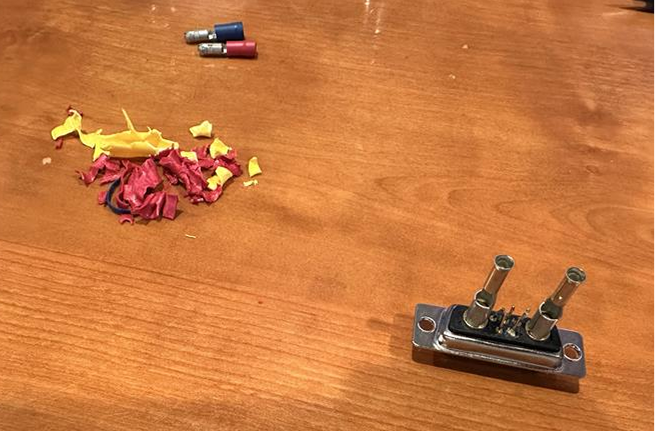
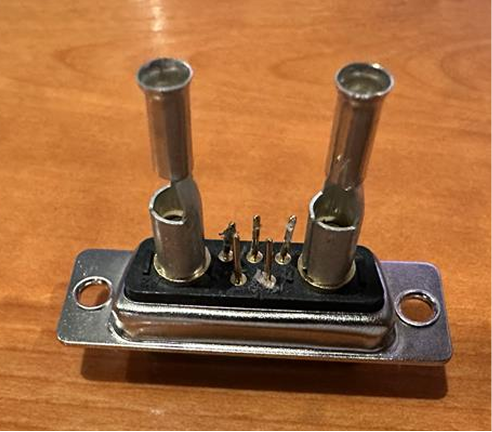
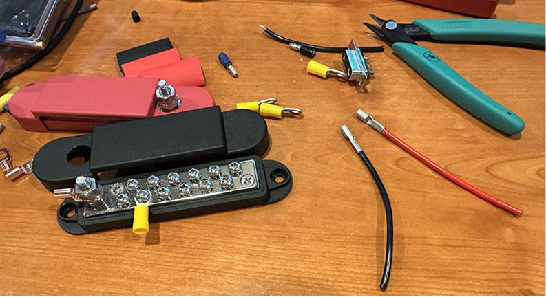
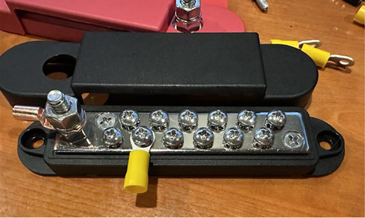
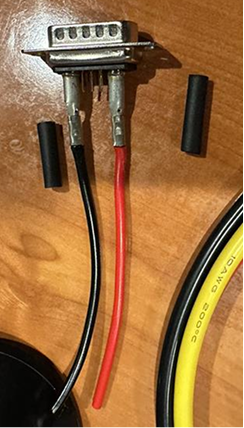
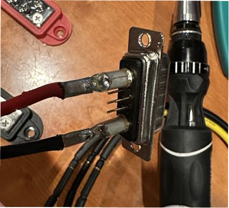
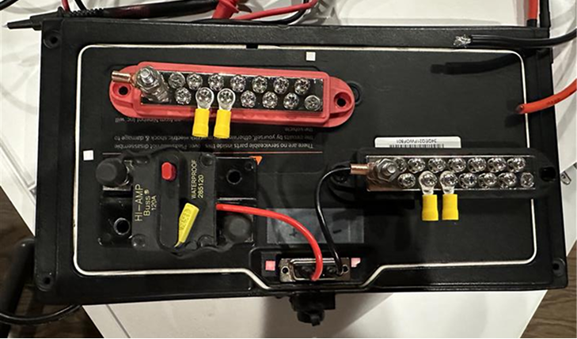
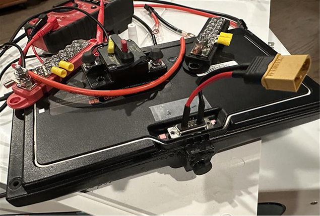
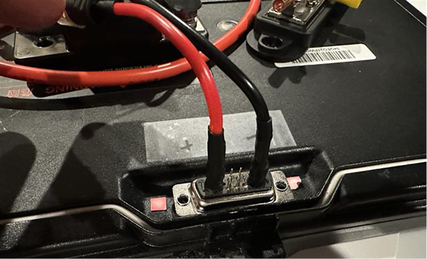

# 2026-05-22 — Stock battery connector and power distribution

Makeshift bullet-connector adapter from the stock Segway battery to XT60 anti-spark output; bus bar layout planning.

---

## 52226-1 — Stock battery connector adapter

Connector fabricated by de-shelling an existing bullet-type connector and adapting it to a 7W2 gold-plated high-current sub-adapter.

## 52226-2 — Adapter prep for soldering

Connector staged for soldering the makeshift adapter to the stock battery connector.

## 52226-3 — Power bus bars

Bus bars that will distribute power from the main battery to subsystems.

## 52226-4 — Bus bar tap detail

Close-up of a bus bar with a connector tapping power for downstream subsystems.

## 52226-5 — Soldered stock connector

Close-up of the soldered makeshift adapter on the stock connector.

## 52226-6 — Adapter process note

Interim adapter when correct parts were unavailable; documents soldering and heat-shrink insulation steps to follow.

## 52226-7 — Solder fill on adapter

Soldering to lock the makeshift connector to the stock connector.

## 52226-8 — Layout estimate

Approximate path: battery adapter → 120 A breaker → distribution (layout not final).

## 52226-9 — XT60 anti-spark output

Tap terminates in XT60; battery rear labeled +/−.
