# 2026-05-24 — Motor phase harnesses and first ESC power-on

Anderson pole motor leads, crimp quality checks, first dual-ESC power-up, hoverboard hub inspection and hall wiring.

---

## 52426-1 — Connector assortment

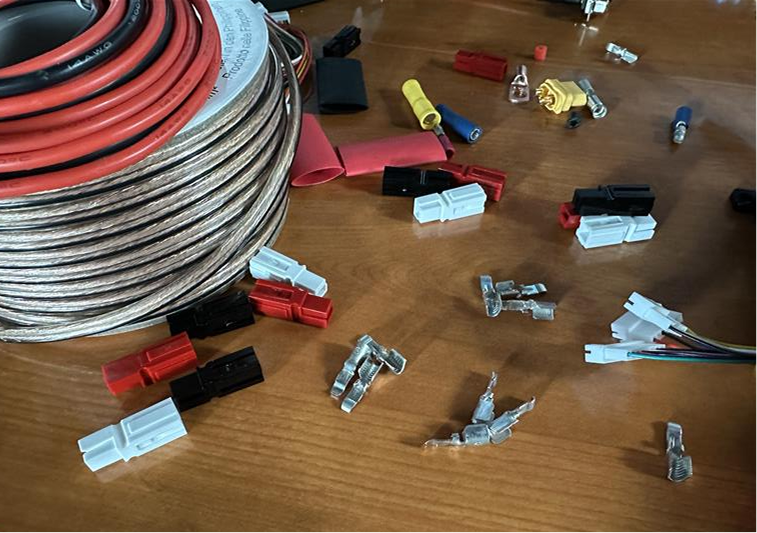

XT60, bus bar lugs, Anderson PP connectors gathered for harness work.

## 52426-2 — Motor lead strip length

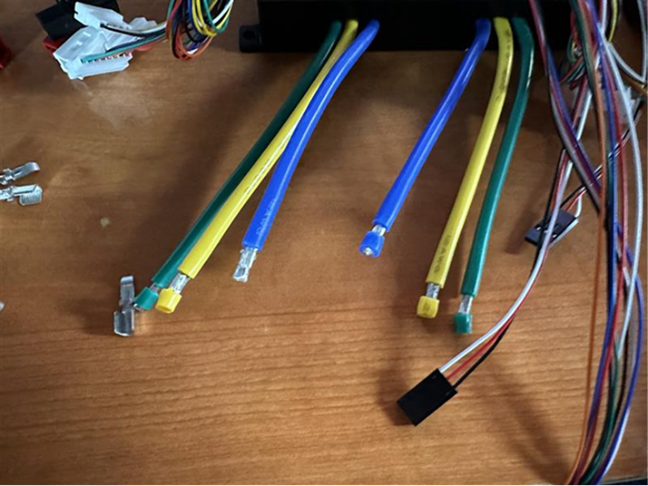

Motor wires stripped ~2 mm before Anderson crimping.

## 52426-3 — Anderson crimp tool

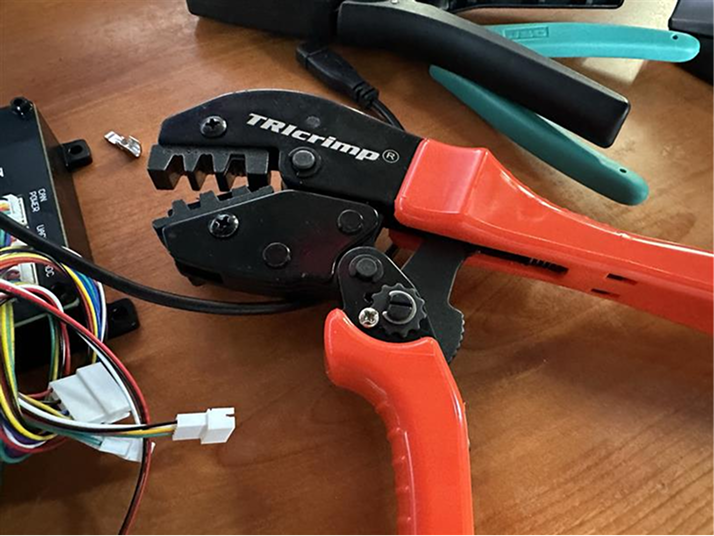

Crimp tool for Anderson pole terminals.

## 52426-4 — Crimped leads with housings

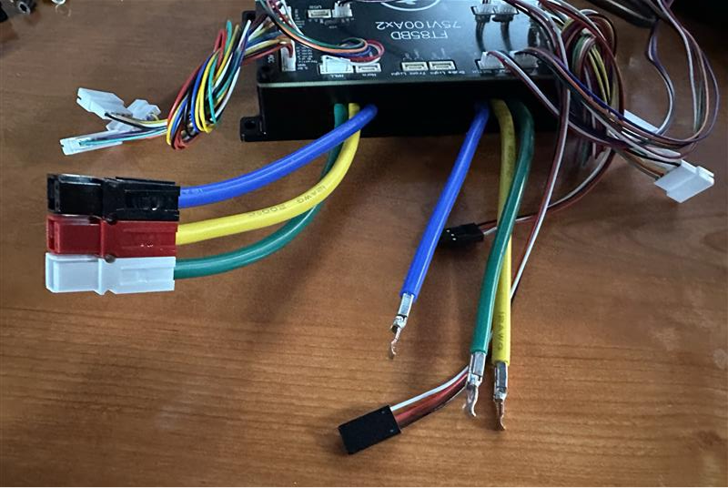

Crimped leads and housed assemblies; keep phase color mapping consistent.

## 52426-5 — Good crimp reference

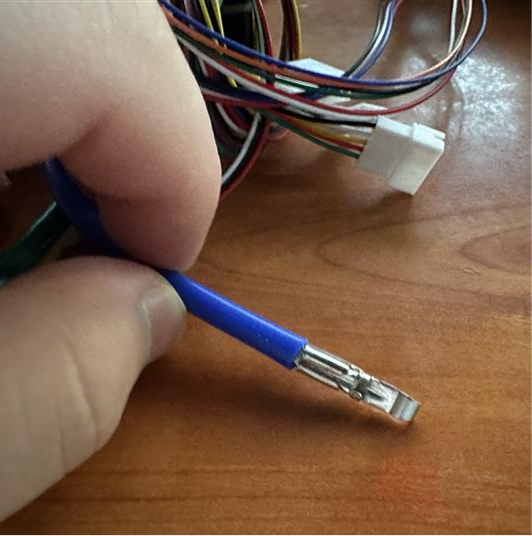

Target crimp quality; verify continuity and low resistance after every crimp.

## 52426-6 — Completed motor harnesses

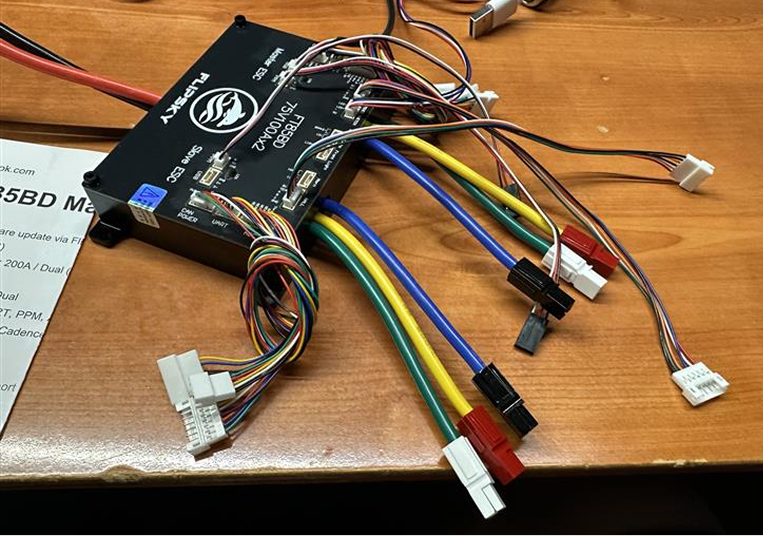

Both motor phase harnesses with Anderson housings.

## 52426-7 — First system power-on

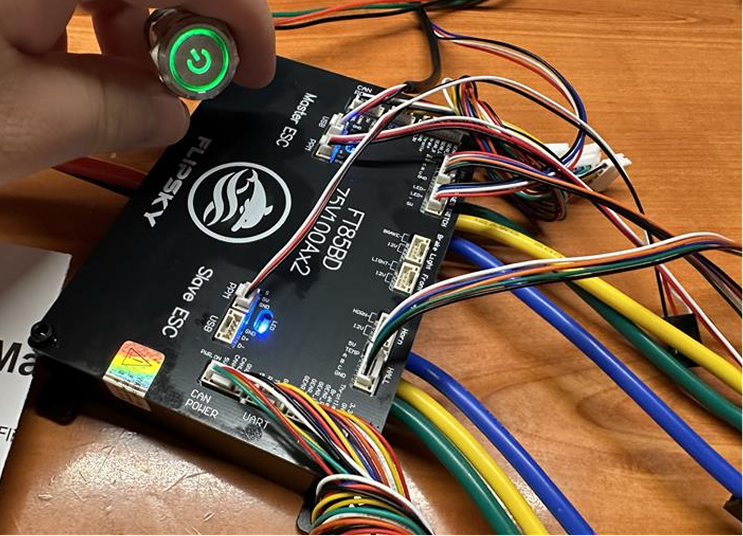

Green alive LED; LED1/LED2 show both motor channels up.

## 52426-8 — Hoverboard hub wheel

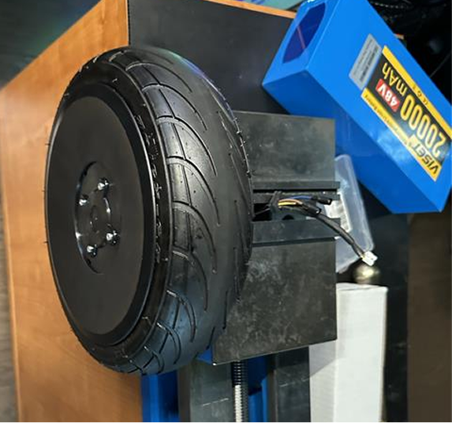

Wheel out of chassis; record diameter and sidewall markings.

## 52426-9 — ESC-to-hub connection

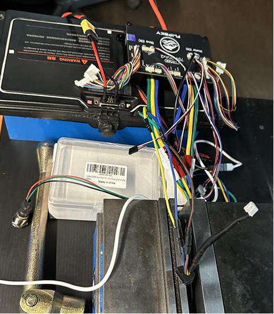

Brown/blue/yellow phases for initial spin test.

## 52426-10 — Hall sensor harness

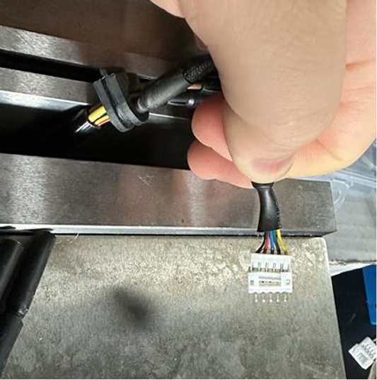

Black=GND, red=V+, blue/green/yellow = hall A/B/C.

## 52426-11 — Wheel interior marking

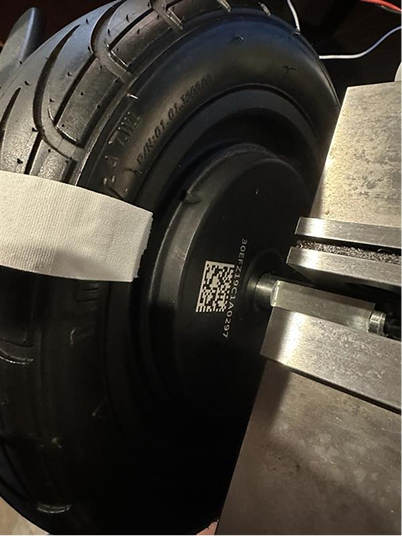

Manufacturing ID: `30EFC19C1A0297`.

## 52426-12 — Wheel sidewall marking

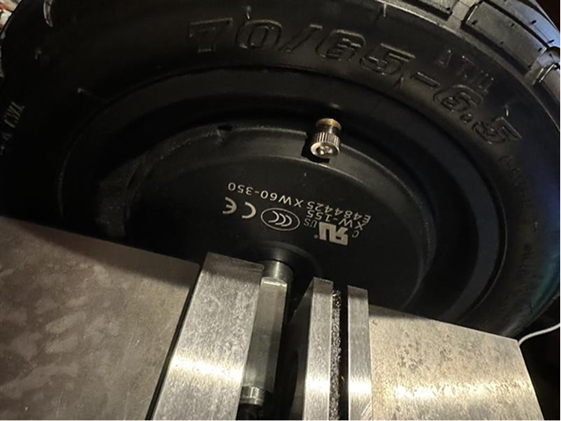

Marking `E484425xw60-350` recorded.
