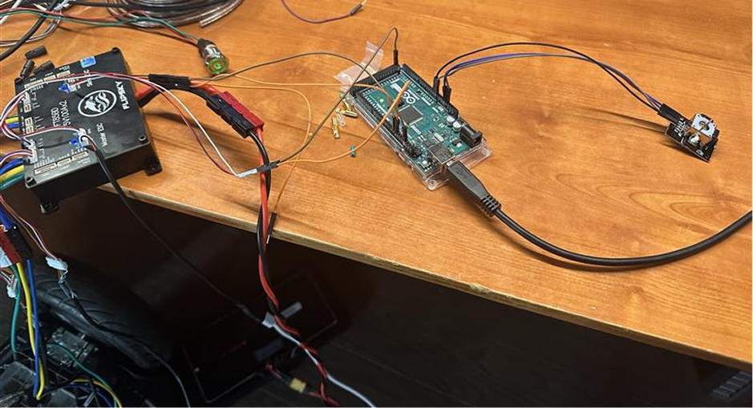
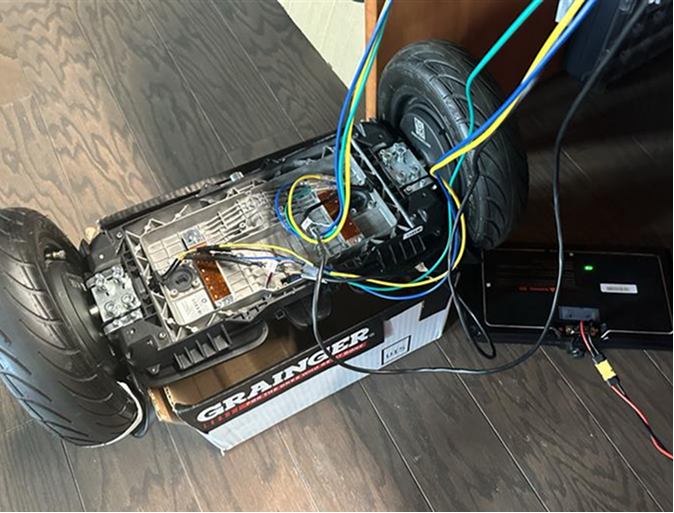
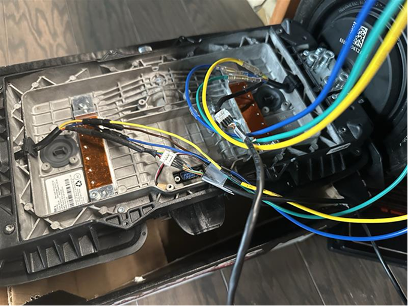

# 2026-05-29 — Preliminary control with Mega and hall calibration

Arduino Mega + analog joystick PPM bench rig; hall sensors wired for motor identification.

---

## 52926-1 — Joystick PPM bench rig

Mega feeds PPM to FT85BD; battery powers ESC.

## 52926-2 — Motor + hall wiring

Phase and hall connected for calibration.

## 52926-3 — Hall connector close-up

Custom bullet connectors on working hoverboard — primary test platform.
