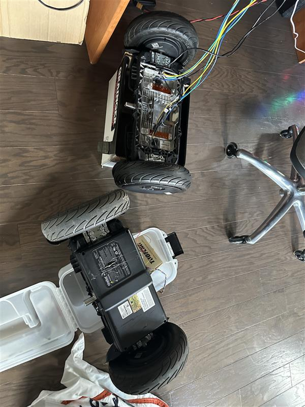
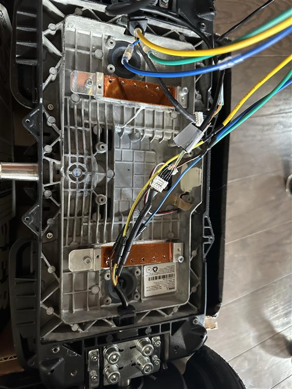
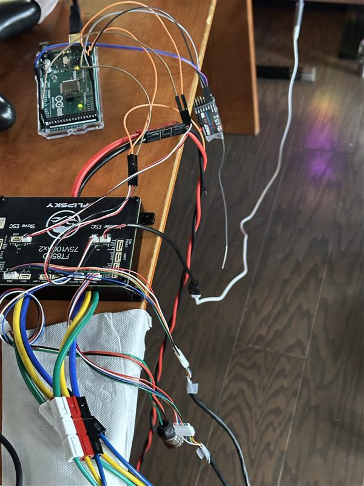

# 2026-05-30 — Stock hoverboard teardown vs test rig

Compare stock assembly to stripped test configuration; RC receiver replaces joystick.

---

## 53026-1 — Stock vs test assembly

Stock hoverboard with current-sense sandwich vs stripped test rig.

## 53026-2 — Gutted internals

Stock PCBs removed for space and weight.

## 53026-3 — RC receiver on Mega

Radiolink receiver replaces analog joystick.
