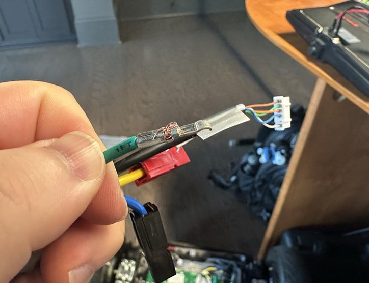
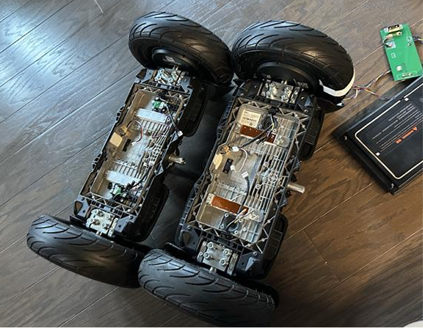
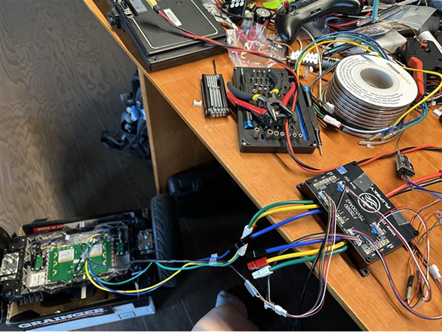
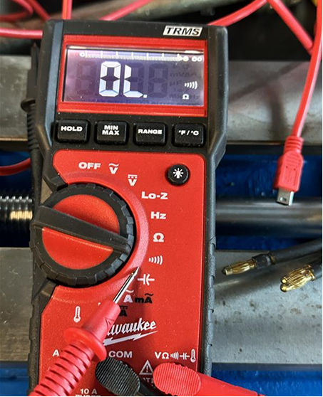
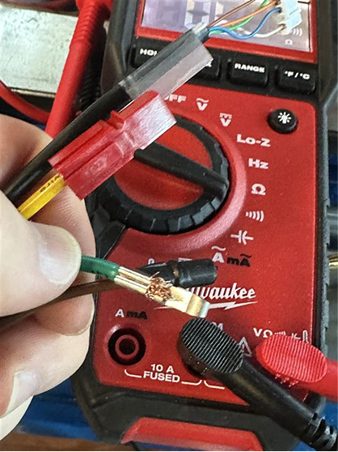
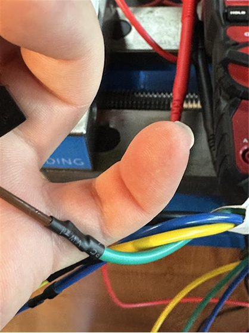
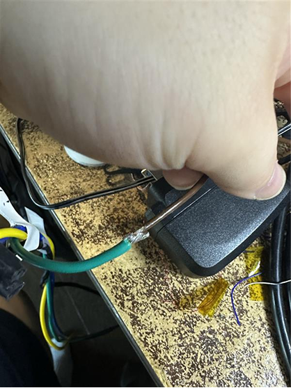
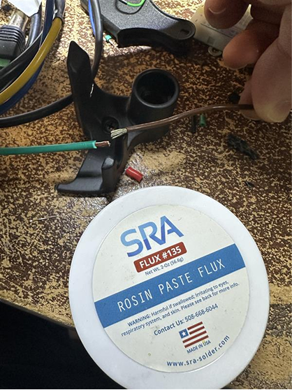
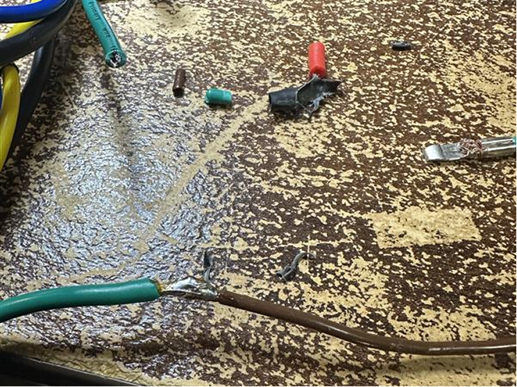

# 2026-06-03 — Harness faults: crimp and cold solder

Intermittent calibration traced to bad green-wire crimp and cold solder on motor lead extensions.

---

## 60326-1 — Bad crimp discovery

Green wire poor contact caused intermittent tuning — continuity-check all crimps.

## 60326-2 — Two hoverboards compared

One board later found with damaged hall hardware from prior lab use.

## 60326-3 — Loaded test rig

Battery connected for motor runs.

## 60326-4 — Multimeter continuity

Use continuity mode; target near 0 Ω.

## 60326-5 — Problem green wire

Crimp may have grabbed insulation not copper.

## 60326-6 — Motor lead extension

High-temp solder + rosin on thick stranded stock leads.

## 60326-7 — Cold solder joint

Rough unsoldered patches — unreliable connection.

## 60326-8 — Rosin paste rework

Flux before re-flow.

## 60326-9 — Re-flowed joint

Completed joint after rework.
