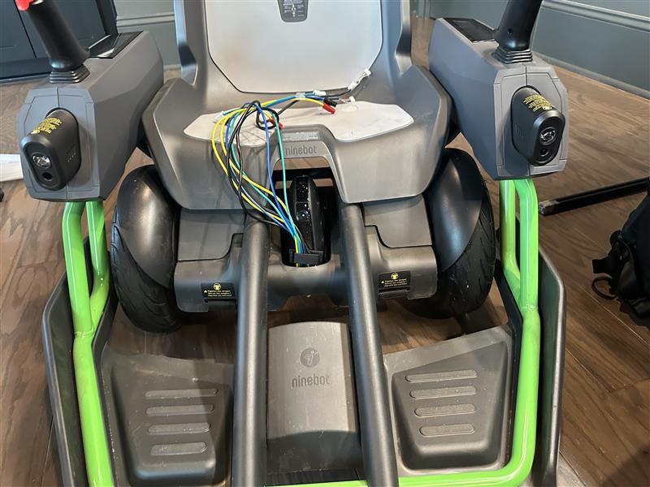
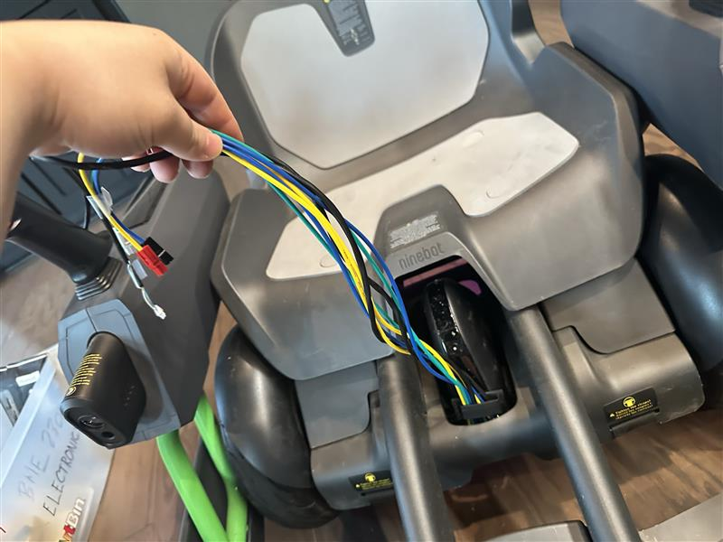
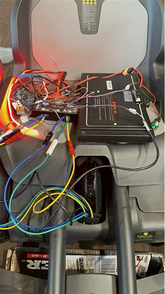

# 2026-06-04 — Chassis integration and wire routing

Wheels mounted under Mecha kit; electronics placement and accessory lighting notes.

---

## 60426-1 — Wheels mounted under chassis

Loaded test: route leads and plan electronics mount.

## 60426-2 — Lead routing options

Harness length allows front or rear exit.

## 60426-3 — Full electronics stack

Battery reposition; ESC ambient brake light; headlight/horn untested.
