# 2026-06-12 — Battery CAD, 3D-printed frame iterations

Fusion 360 battery model, split 3D prints, alignment fixes for stock power port.

---

## 61226-1 — Battery photo for CAD

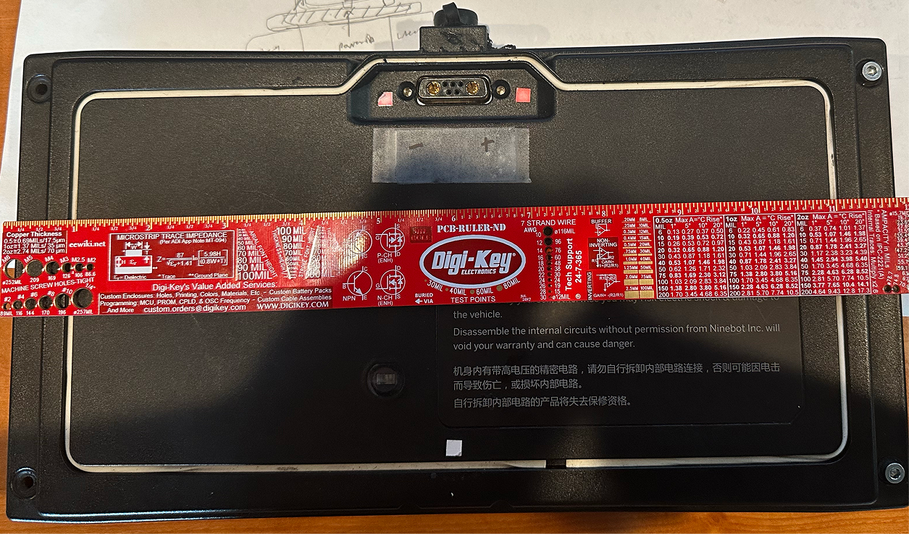

Ruler reference for Fusion 360 hole layout.

## 61226-2 — Fusion 360 calibration

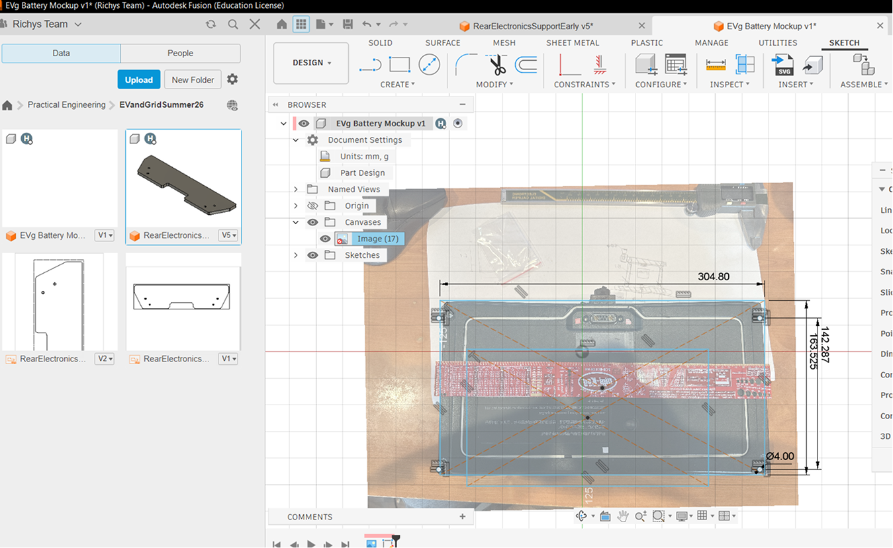

Image scaled; parallax limits accuracy.

## 61226-3 — Hole and plug layout concept

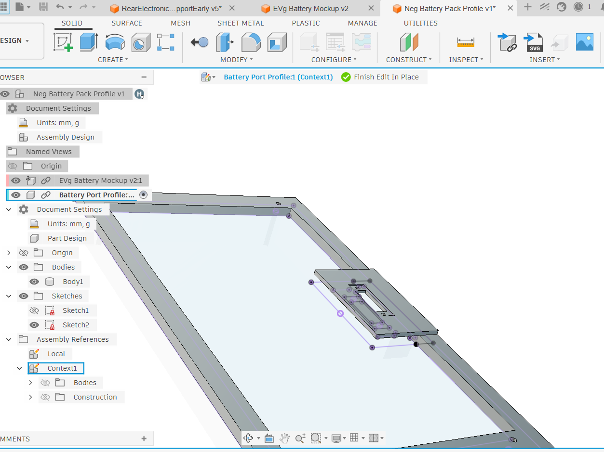

Battery mount holes and power port cutout check.

## 61226-4 — Split frame for print bed

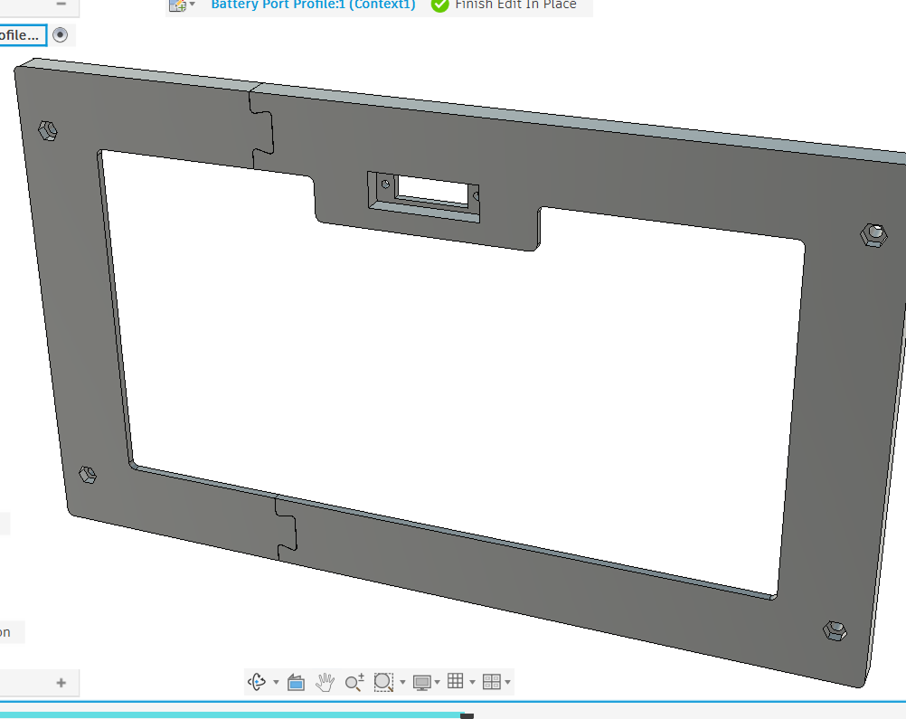

Two-part print — printer too small for one piece.

## 61226-5 — Print orientation v1

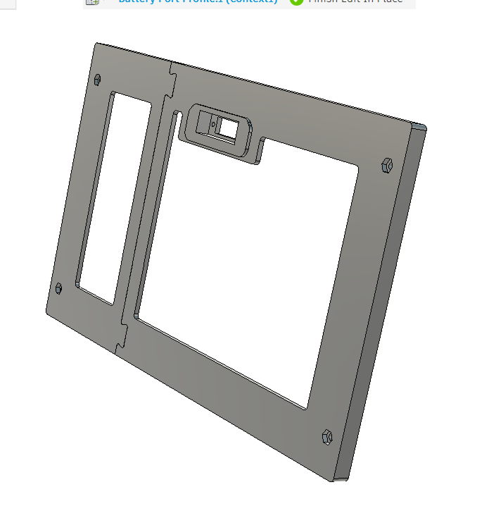

Alternate view of split frame.

## 61226-6 — Bambu slicer prep

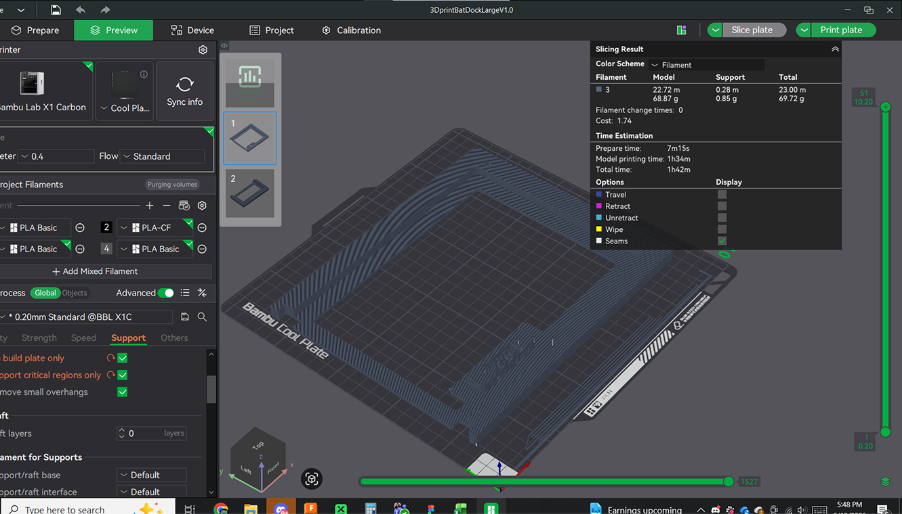

~1.5 h per part.

## 61226-7 — MDF + printed insert concept

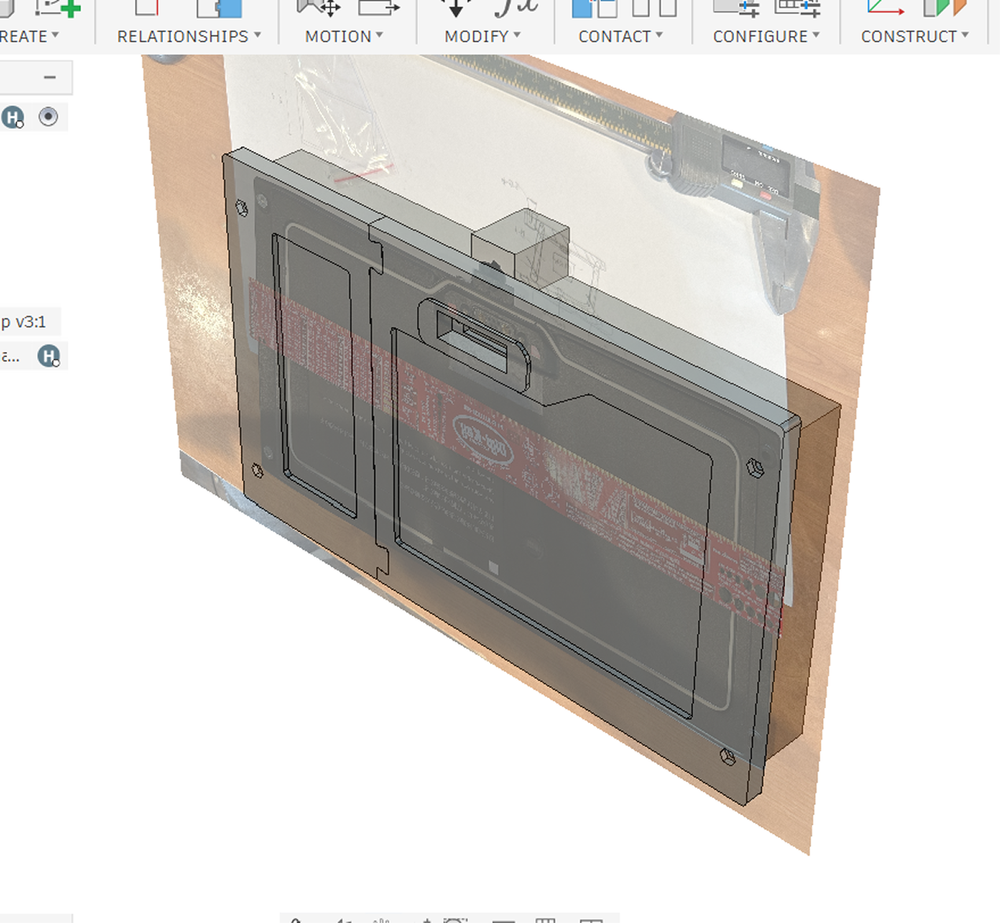

Iterative tolerance on power plug opening.

## 61226-8 — Reference image mesh

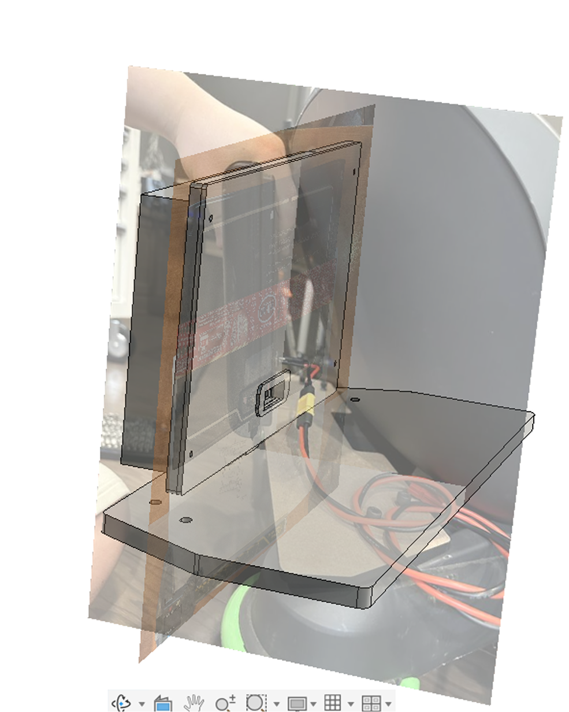

Assembly spacing study — parallax limited usefulness.

## 61226-9 — First print complete

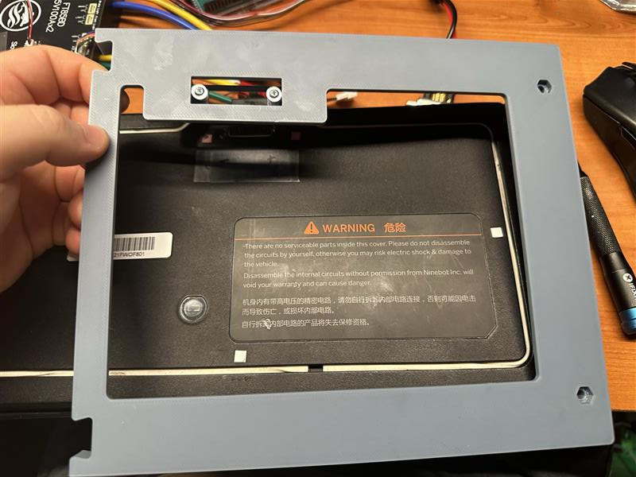

Missing correct screws for stock plug mount.

## 61226-10 — Alignment issues v1

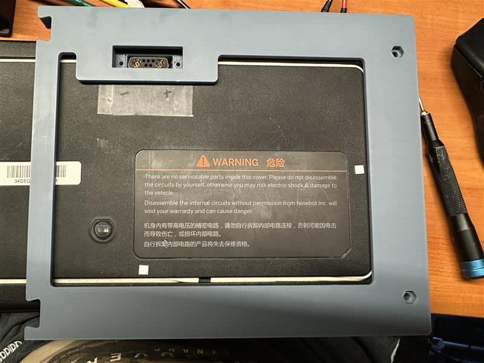

Battery corner holes misaligned; plug off-center.

## 61226-11 — Plug attaches to print

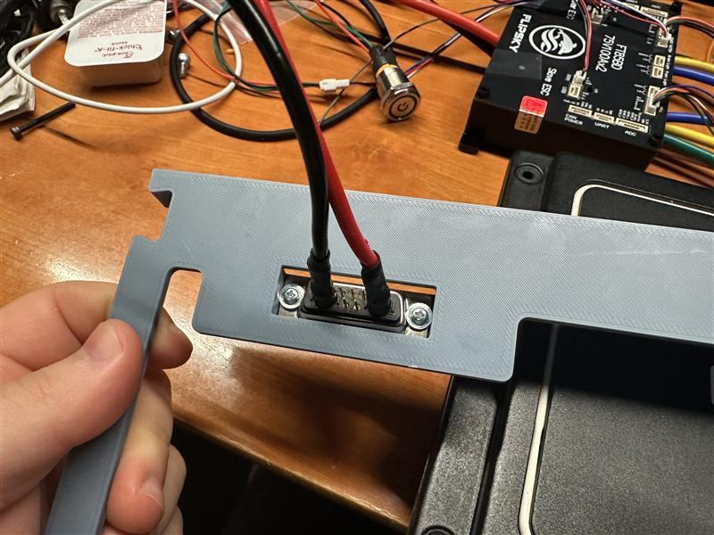

Harness works but frame dimensions wrong.

## 61226-12 — Protruding screws

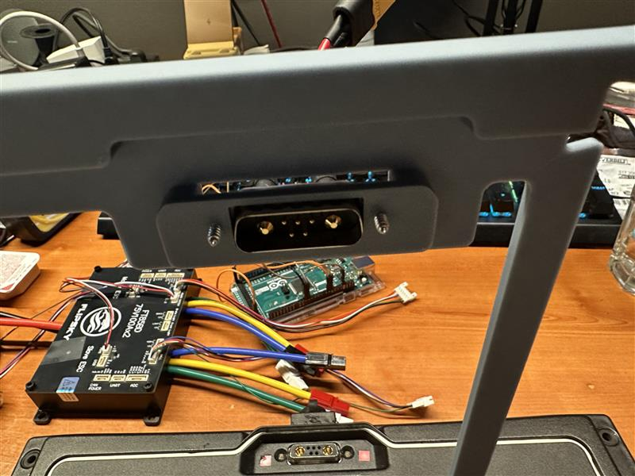

Wrong screw length — still secures plug for alignment test.

## 61226-13 — Forced fit analysis

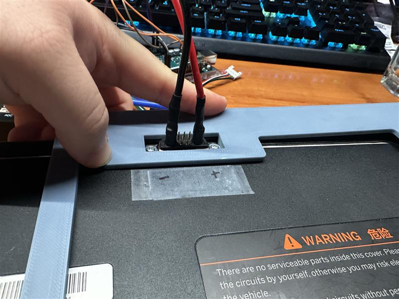

Right side pops off; center plug aligns — lengthen frame + fix holes.

## 61226-14 — Custom bullet power tap

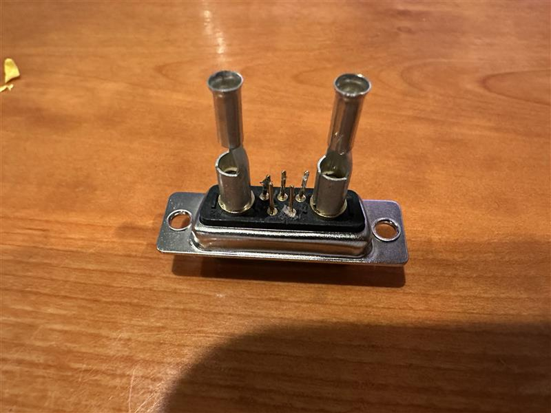

Small BMS pins unused — Segway app data not needed.
