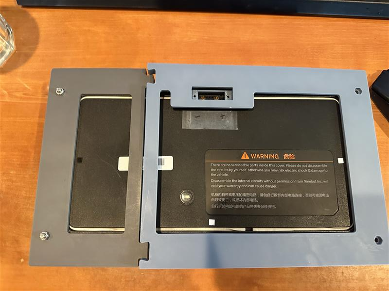
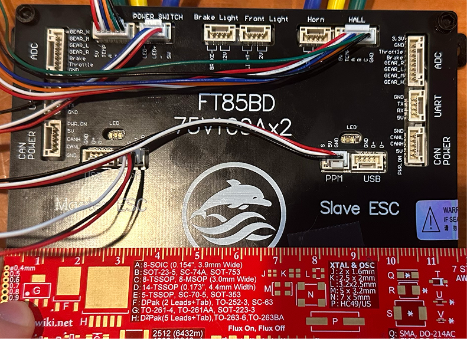
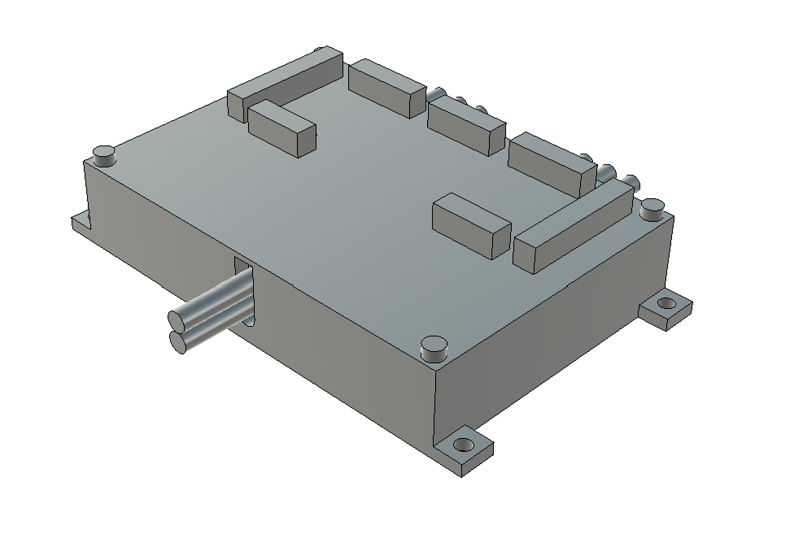

# 2026-06-13 — Frame interlock and ESC CAD mock-up

Two-part battery frame fit issues; Fusion 360 ESC envelope for rear assembly.

---

## 61326-1 — Split frame length short

Halves lack overlap length — add interlocking fingers.

## 61326-2 — ESC photo for CAD

Reference capture for ESC mock-up model.

## 61326-3 — ESC CAD mock-up

Heights, clearances, and lead wire bandwidth for full assembly.
