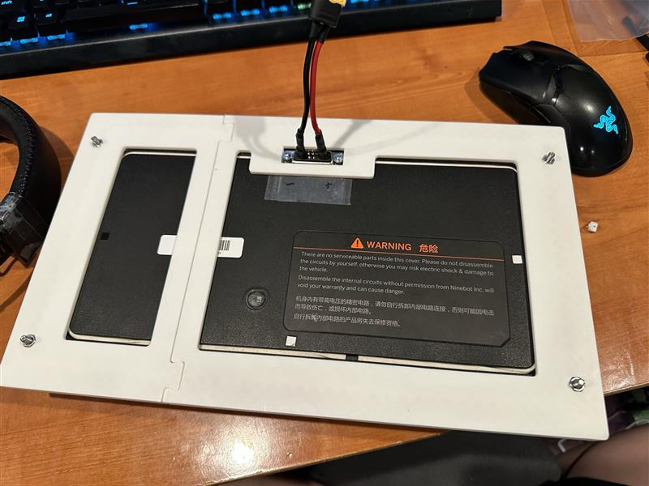
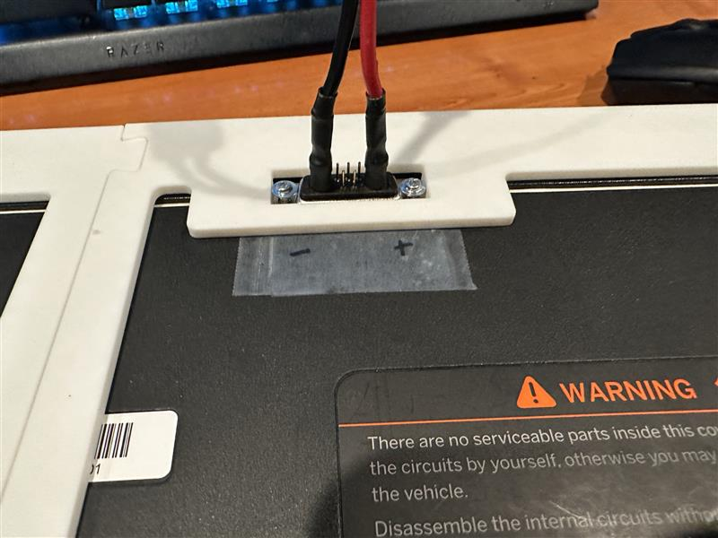

# 2026-06-14 — Battery frame v2 alignment

Updated 3D-printed battery frame; minor gap between halves accepted for now.

---

## 61426-1 — Frame v2 overview

Updated alignment; small gap between halves — forced fit for now.

## 61426-2 — Plug fit close-up

Stock plug seats correctly in printed frame.
