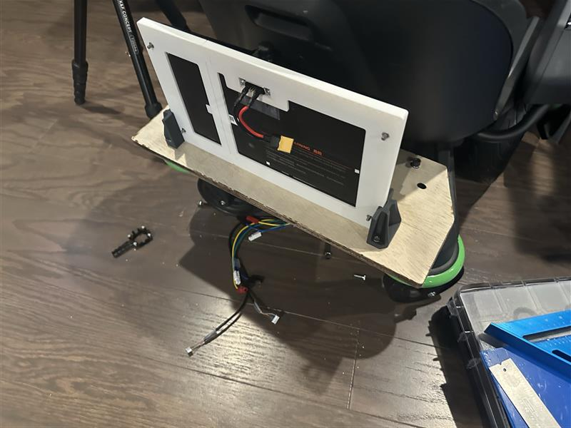
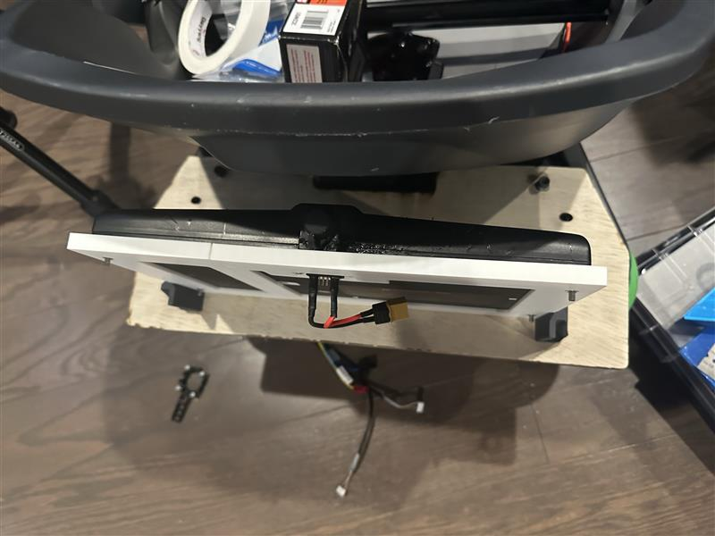
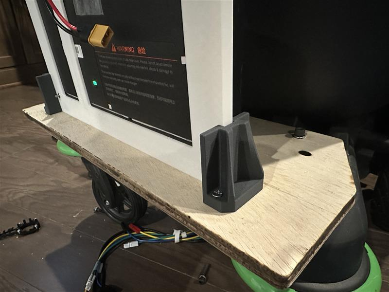
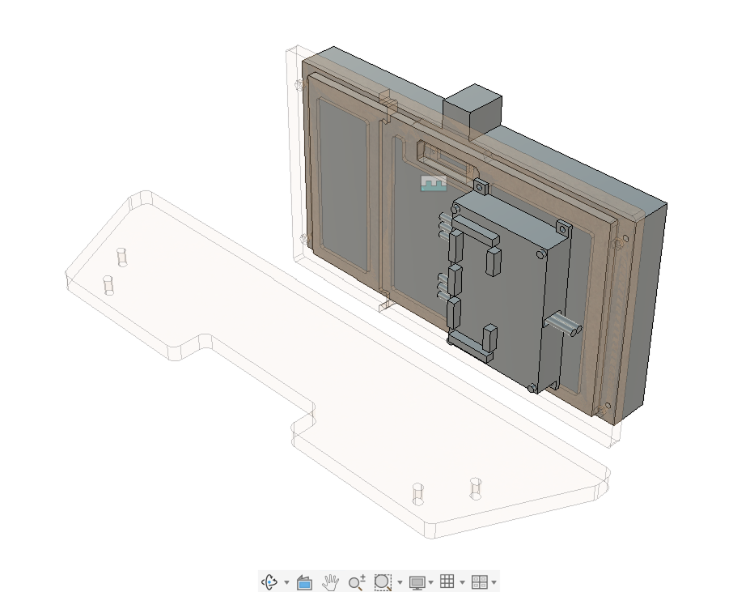
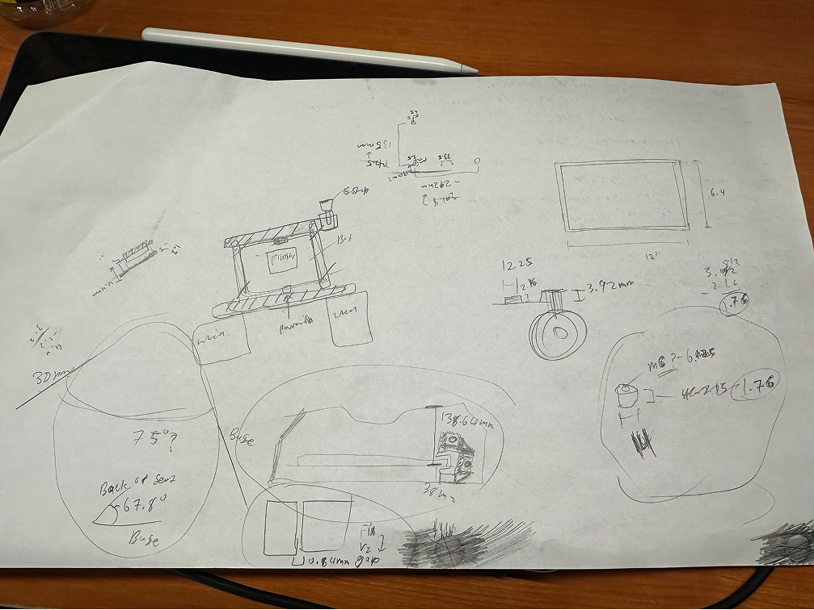
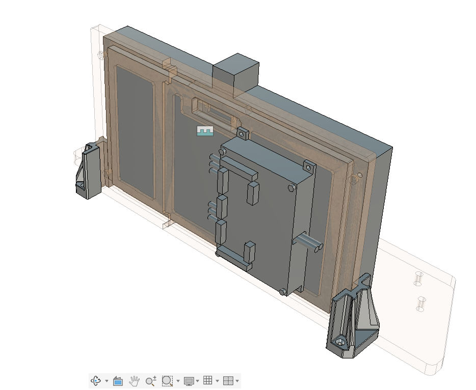

# 2026-06-20 — Battery support brackets and ESC placement

Carbon-fiber PLA vertical battery supports; CAD full assembly and seat angle measurements.

---

## 62026-1 — Battery support prototypes

Slot-in supports for fore/aft battery position trials (CF-PLA, wood-screwed to plywood).

## 62026-2 — Supports side view

Battery seated in printed adapters.

## 62026-3 — Support performance

Small prints proved surprisingly rigid under battery mass.

## 62026-4 — ESC placement ideation

Compact stack: ESC on battery back, Arduino to the side.

## 62026-5 — Seat angle scratch measurements

Seat back ~67.8° from horizontal — battery must sit below this.

## 62026-6 — Full CAD assembly

Visualized target rear packaging.
