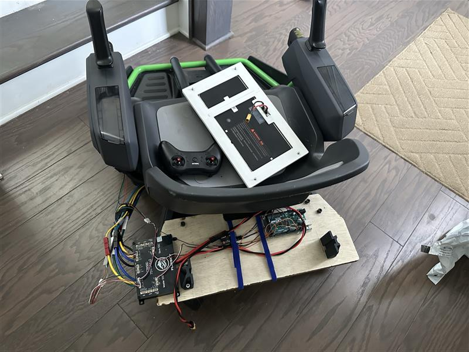
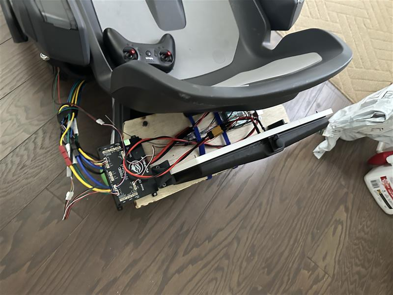

# 2026-06-22 — First rear-panel integrated prototype

Plywood carrier with ESC, Mega, RC receiver; ready for first rider-on tests.

---

## 62226-1 — Electronics on plywood base

Wood-screw mounted ESC, Mega, Radiolink RX; hall wires connected.

## 62226-2 — Battery plugged in

Plug clearance from seat back — ready for loaded drive tests.
