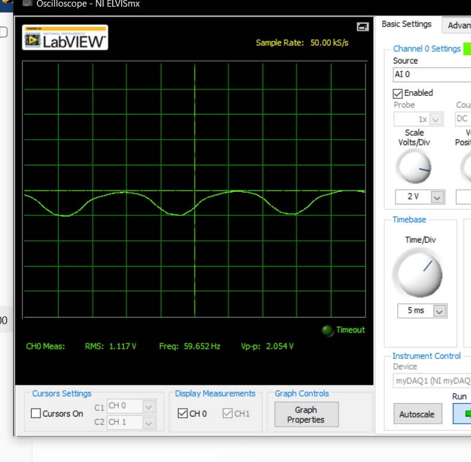
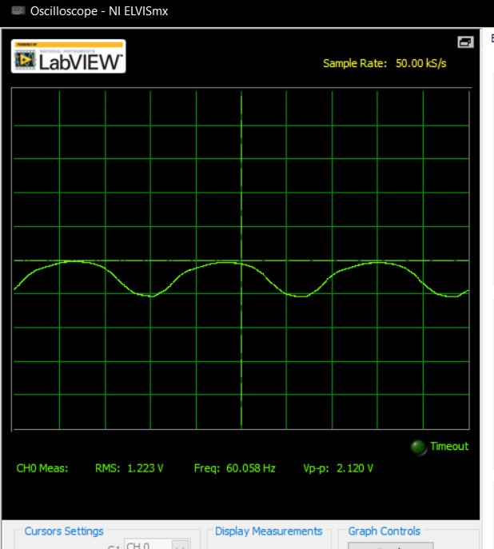
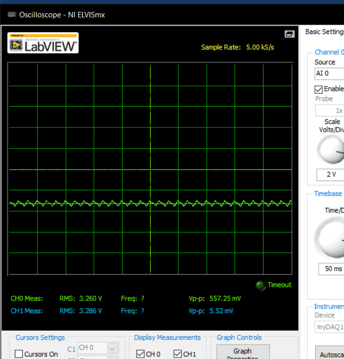
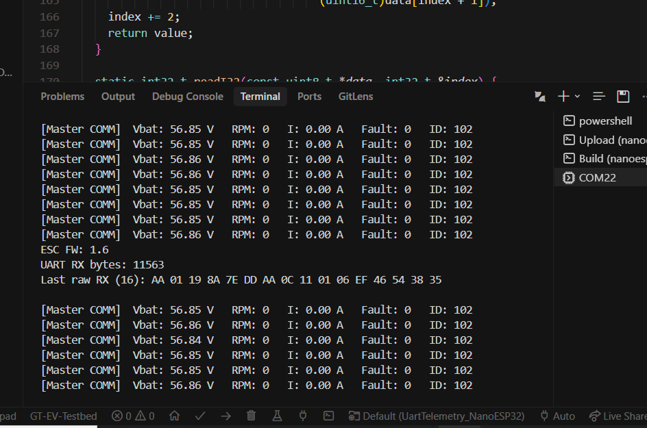
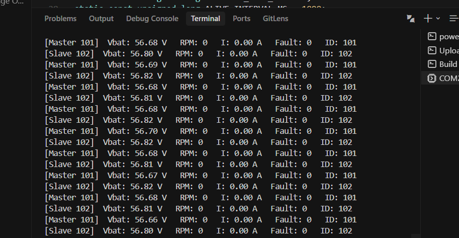
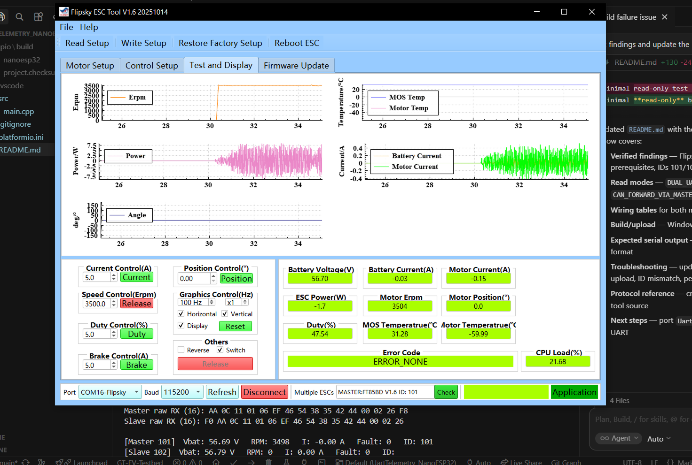
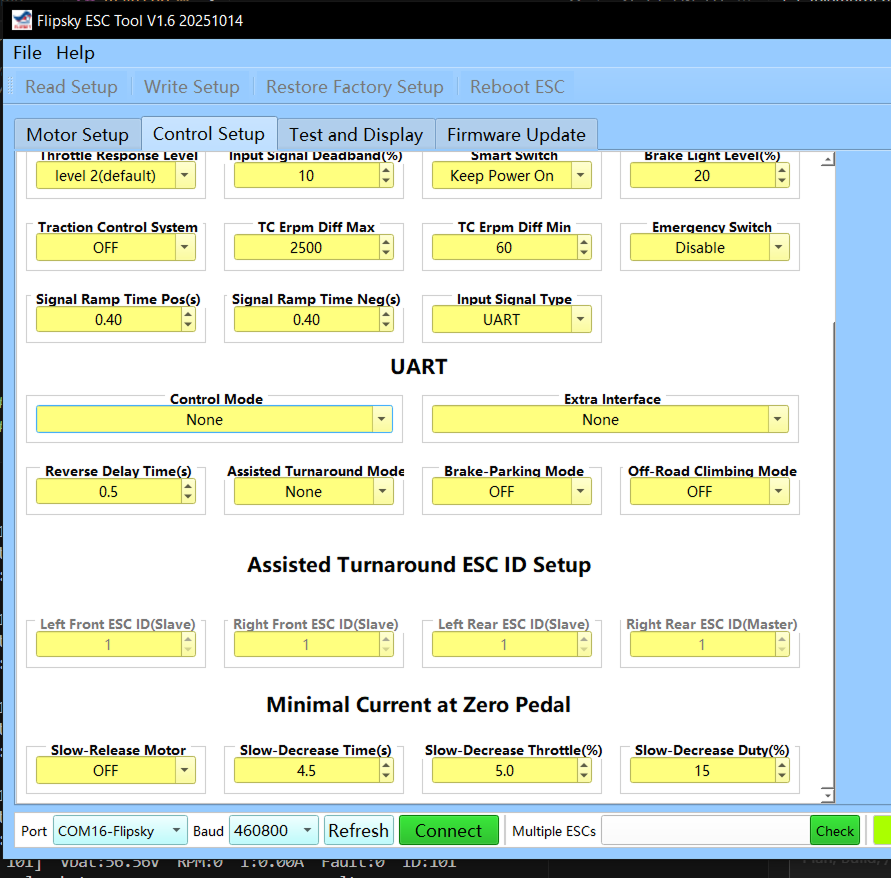

# 2026-07-01 — UART bring-up and logic-level discovery

Organized engineering logs; UART telemetry first success; 3.3 V ESC logic vs 5 V Mega mistake.

---

## 70126-1 — Engineering log organization

Pictures uploaded; dictation workflow for GitHub-linked documentation.

## 70126-2 — UART work begins

Attempt to read battery voltage from cart over UART.

## 70126-3 — 3.3 V logic discovery

FT85BD UART is 3.3 V — Mega 5 V connection was a wiring mistake; damage assessment needed.

## 70126-4 — Oscilloscope probe

NI myDAQ ~3.3 V stable on ESC TX — initial sign of life.

## 70126-5 — Dual ESC telemetry

Master 101 and slave 102 report matching pack voltage, RPM, current, and fault codes.

## 70126-6 — Telemetry under PPM load

Under PPM throttle: ERPM, battery current, motor current visible; no temperature or encoder angle from hall-only setup.

## 70126-7 — Flipsky control setup screenshot

Throttle response level 2; signal ramp pos/neg; input type set UART (later found UART read-only on hobby FT85BD — PPM still required for drive).
