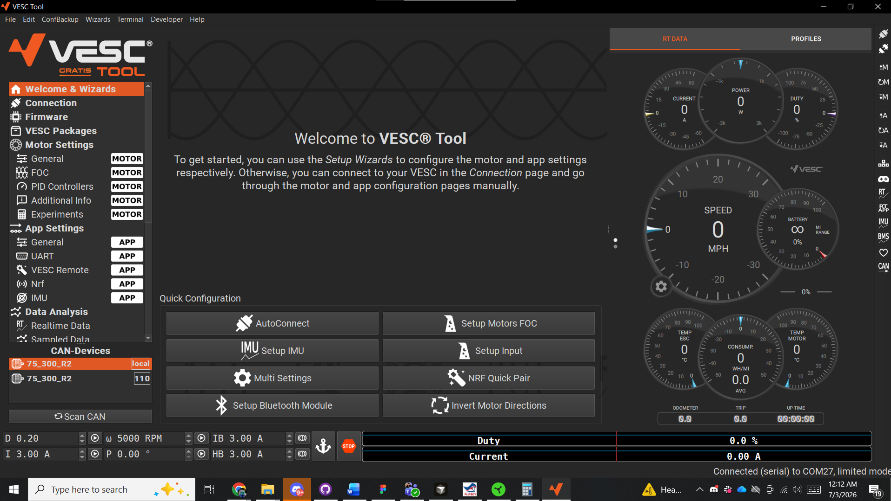
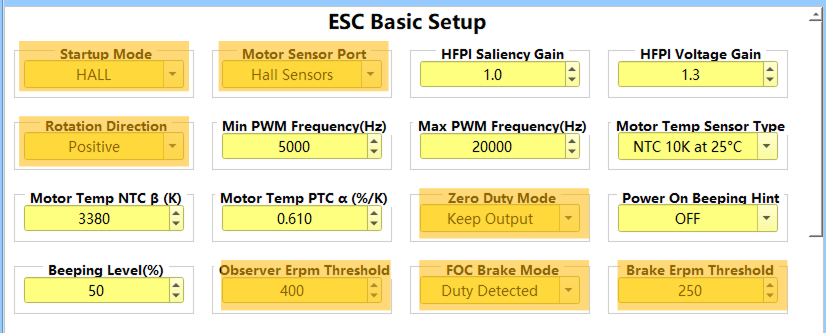
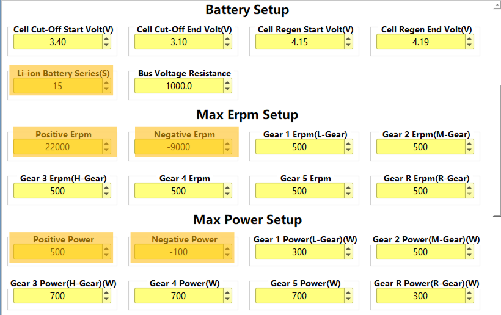
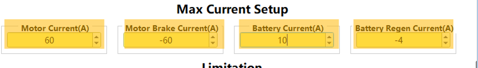
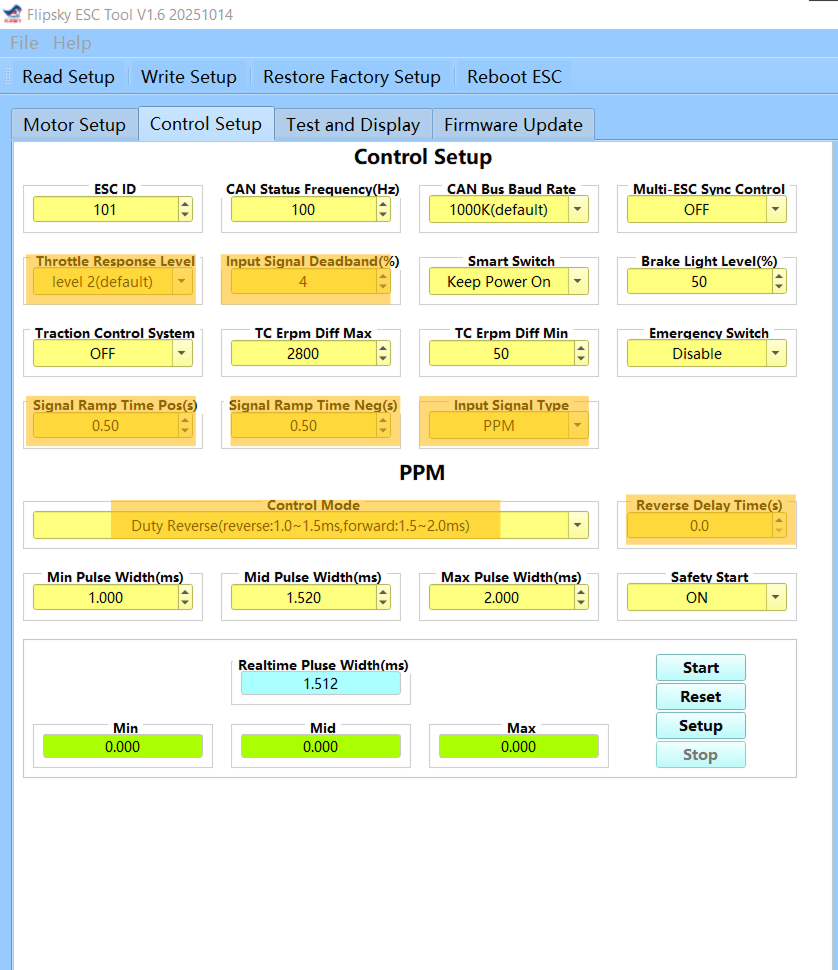
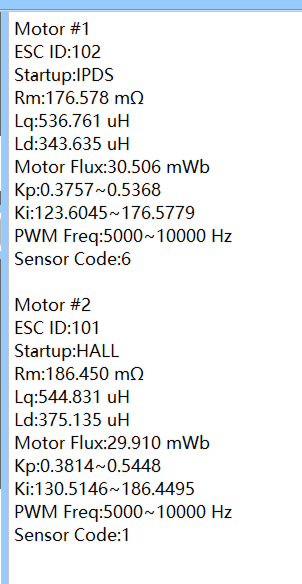

# 2026-07-03 — Flipsky tool tuning and motor fault discovery

Hall startup, ERPM threshold 400, current vs differential instability; motor 1 hall fault on lab-tested hoverboard.

---

## 70326-1 — VESC tool comparison

Original VESC tool vs simplified Flipsky package — far more options on VESC variant.

## 70326-2 — Motor startup settings

Hall start; direction set in tool not firmware; zero-duty keep-output (brake not coast).

## 70326-3 — Observer ERPM threshold 400

Motors struggle below ~400 ERPM in speed mode testing.

## 70326-4 — Max current limits

60 A/motor bench — adequate hill climb with 200 lb payload but **current mode unstable** for differential drive.

## 70326-5 — Control setup page

Throttle response L2, deadband, ramp times; **PPM required** — UART command not viable on hobby FT85BD.

## 70326-6 — Auto-calibrate fault

Motor 1: hall sensor code **6**, startup IPD not Hall — damaged hall on lab-tested hoverboard.
