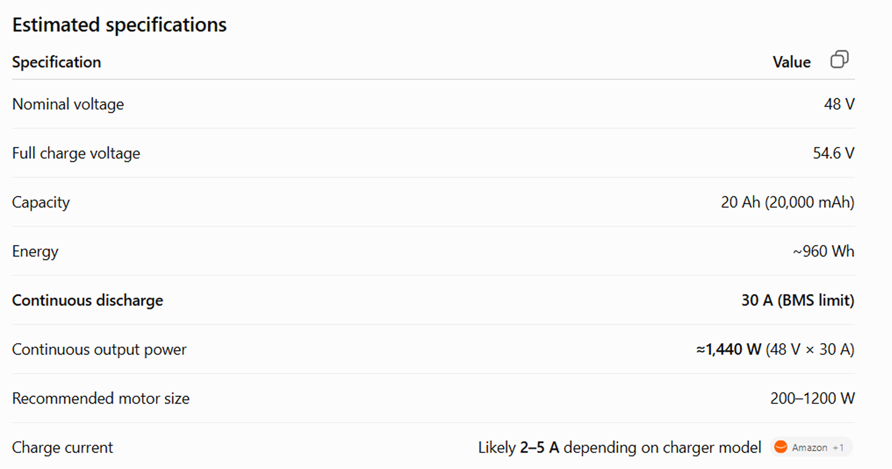
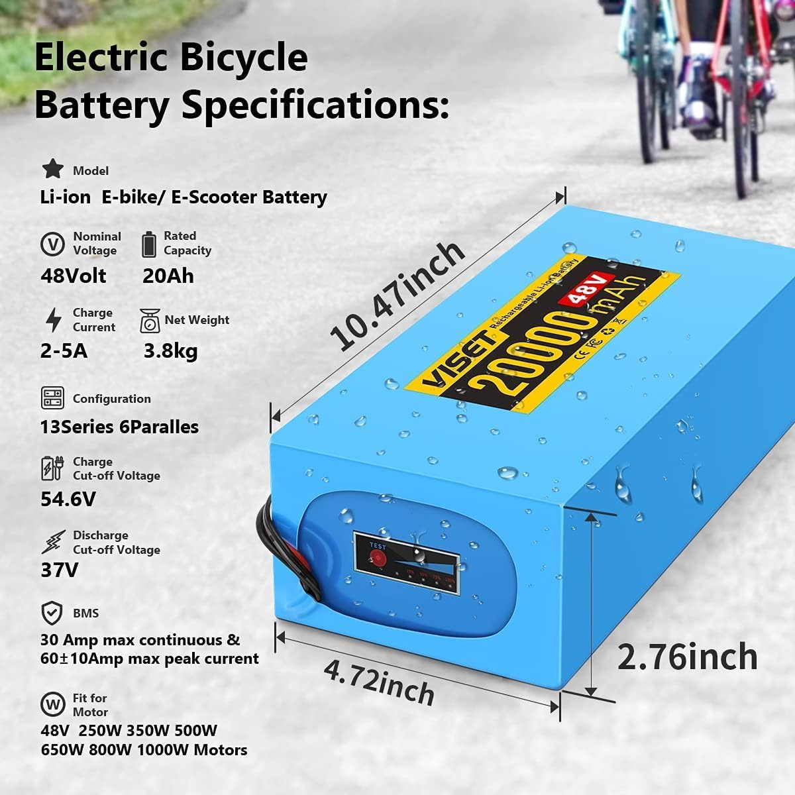
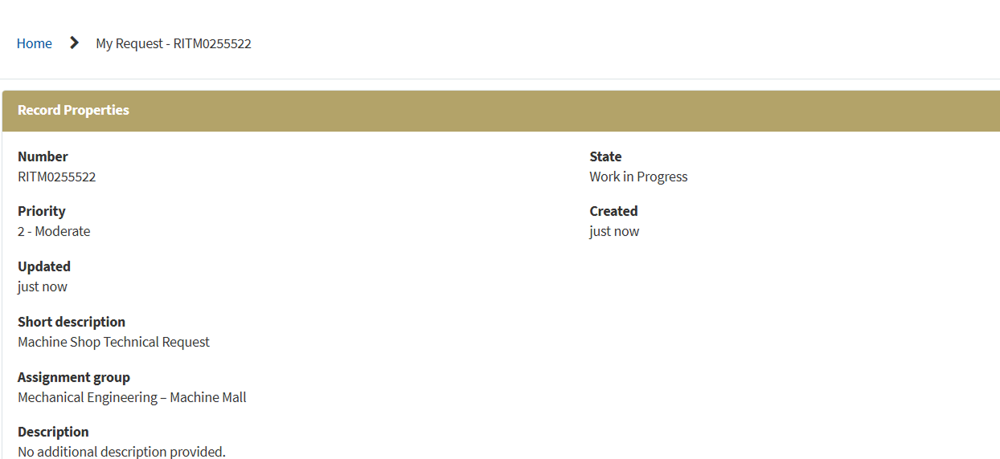
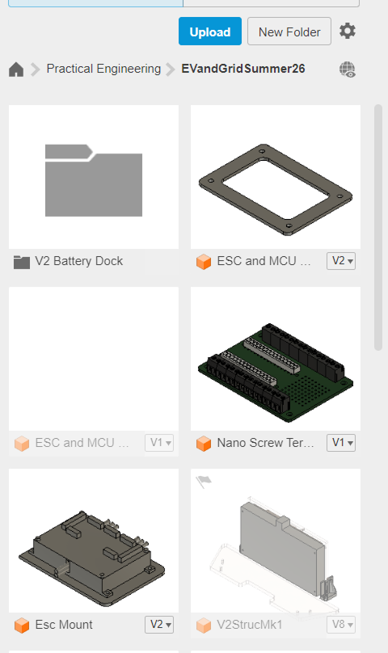

# 2026-07-07 — Duty-cycle mode, shudder debug, SD logging prep

Duty control smooth at low ERPM; current mode spin-outs; speed mode buzz; diagnostic/logger firmware and repo updates.

---

## Session notes (duty-cycle evaluation)

Switched primary tuning focus to **duty-cycle control**:

| Mode | Observation |
|------|-------------|
| **Current** | Strong low-speed torque but **unstable differential drive** — spin-outs with rider; wiped out multiple times. |
| **Speed** | Stable differential behavior but **buzz/hum and hang-up below ~400 ERPM**. |
| **Duty cycle** | **Smooth low-ERPM crawl** (~400 range) without speed-mode lock-up; current priority for rider safety. |

### Debug checklist (in progress)

- Battery sag and stock BMS trip points
- Logic-level noise on dual UART
- Metal screw shorts through plywood mounts
- Whether higher-discharge pack needed for duty mode

### Firmware / repo

- Added diagnostic tools and **UART telemetry SD logger** (`UartTelemetryLogger_NanoESP32`)
- Steering gain at low RPM still weak in `UartSpeedController_NanoESP32` — on TODO list

## 70726-1 — Alternate battery research

48 V 20 Ah pack specs (AI-assisted) vs stock Segway ~15 A BMS limit — conjecture.

## 70726-2 — Product page reference

Electrical parameters for Flipsky battery setup.

## 70726-3 — CAD spacer request

Requested Mecha kit current-sensor spacer CAD from course staff to skip re-measure.

## 70726-4 — EV Grid summer project files

Footprint templates for ESC and MCU rear-panel integration.
